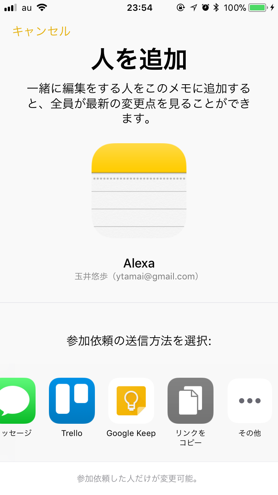
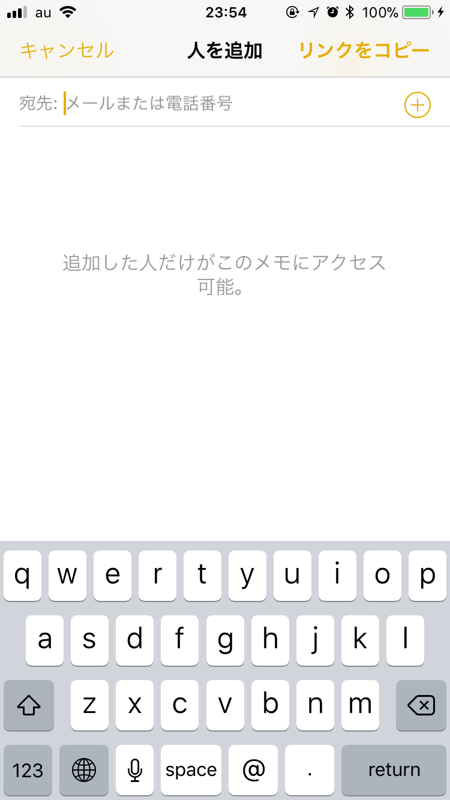

# Apple Notes

Apple純正のメモアプリ。日本語環境では「メモ.app」、英語環境では「Notes.app」になる。

[AppleScript: The Notes Application](https://www.macosxautomation.com/applescript/notes/index.html)

## Apple Notes.app（メモ.app）でのノートリンク取得方法

得られるのは`https://www.icloud.com/notes/0UkyR70h6xLZzl6G9tjdP5G3g`のようなicloudのリンクになる。ネットワーク接続がないと踏めないが、「取得中」が出てすぐにローカルのメモを開くことができる。Evernoteのクラシックノートリンク（これがクラシックになった頃からおかしくなってきた）やiOSでのGoogle Documentのリンクのようにオフラインでも確実に踏めれば良いのだが。

### macOSの場合

共有メニューで「リンクをコピー」、自分のメールアドレスを入力、「共有」ボタンを押す。次回からは共有メニューで「リンクをコピー」で取得できるようになる。

### iOSの場合

共有メニューから「リンクをコピー」、メールアドレスを入れなくても右上の「リンクをコピー」が押せるのでそれで取得可能。ただし文字列にリンクを設定するのはiOS版ではできない。

|                                       |                                       |
| ------------------------------------- | ------------------------------------- |
|  |  |

## Alfredでノートを検索するWorkflow

以前はノートの実態が置かれているディレクトリを検索パスに加えてやれば標準機能で検索可能であったが、SQLベースになってからはOS標準のSpotlightでは検索できるが、Alfredでは検索できないという悲しい状況が続いていた。Workflowも適当なものがなかったが、以下のものは（ノートしか検索できないが）Alfredからメモ.appのノートを全文検索することができる。

[Search Apple Notes | Packal](http://www.packal.org/workflow/search-apple-notes)

[sballin/alfred-search-notes-app: Use Alfred to find and open notes in iCloud/Apple Notes.](https://github.com/sballin/alfred-search-notes-app)

### ローカルのノートリンク（非公式版）

このWorkflowディレクトリの中に`Note Opener.app`というアプリケーションが入っていて、Workflowでの検索でoptionキーを押しながら選択することでノートリンク（実際には公式のidと関係なく`notes://title`の模様）が取得され、`Note Opener.app`をアプリケーションディレクトリに入れておけば開くことができるようになる。ただし当然macOS上でのみになるため、iOSでは動かない。

[Search Apple/iCloud Notes (High Sierra, Mojave, and more) - Share your Workflows - Alfred App Community Forum](https://www.alfredforum.com/topic/11716-search-appleicloud-notes-high-sierra-mojave-and-more/?tab=comments#comment-63513)