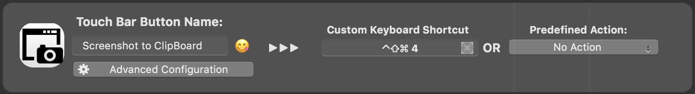

# macOS-Tips

macOS（OSX）で忘れがちな操作をメモ。

## ファイル選択ダイアログ関連

標準だと隠しフォルダとかファイルが選択できなくて結構不便だったりする。

### ファイルダイアログで隠しファイル・隠しフォルダを表示

ダイアログを開いた後に「`⌘+⇧+.`」（コマンド＋シフト＋ピリオド）を押すことで隠しファイル・フォルダも表示されるようになる。

### ファイルダイアログでパス指定で入力

ダイアログを開いた後に「`⌘+⇧+G`」を押すとパスを入力するダイアログが開くので、そこでパスを入力すれば隠しフォルダなどでも直接移動できる。

### ファイルダイアログで開いているディレクトリをFinderで開く

ダイアログで開いているフォルダを開いて操作したい場合は「`⌘+R`」でFinderで開くことができる。

### ドラッグ＆ドロップ

ダイアログにファイルやフォルダをドラッグ＆ドロップするとそのファイルやフォルダを選んだ状態になる。

## macOSでのスクリーンショット

[Mac でスクリーンショットを撮る方法 - Apple サポート](https://support.apple.com/ja-jp/HT201361)

基本的にデスクトップに「png」ファイルとして保存される。BetterTouchTool でも設定しておくと便利（5本指ForceTouchにしている）

### 基本操作

- ⌘+⇧+3：画面全体
- ⌘+⇧+4：範囲を選択
- ⌘+⇧+5：Mojave以降で動画含めた総合コントロールを表示

### ウインドウのスクリーンショット

⌘+⇧+4でポインタが出たら「スペースバー」を押すとポインタがカメラになるのでウインドウを選択

### メニューのスクリーンショット

メニューを選択して開いた状態で上記（範囲選択ないしウインドウ）

### Touch Barのスクリーンショット

⌘+⇧+6

### ファイルではなくクリップボードに保持

上記コマンドに「⌃」を追加すれば良いがちと押しにくい

VSCodeの[Paste Image](https://marketplace.visualstudio.com/items?itemName=mushan.vscode-paste-image)拡張機能でよく使うので、BetterTouchToolを使ってTouchBarにボタンを作成してある。



## アプリケーションの言語設定

[OSXで特定のアプリケーションだけを英語で起動する - Qiita](https://qiita.com/isicava@github/items/ceaba68c3dc88bb00b59)

VSCodeとか、日本語メニューになると逆に面倒な場合に。利用が確定したら[dotfiles/defaults](https://github.com/u-4/dotfiles/blob/master/lib/defaults)に設定しておく。

```bash
defaults write -app アプリケーション名 AppleLanguages "(en, ja)"
```

設定を解除する場合には

```bash
defaults delete -app アプリケーション名 AppleLanguages
```

## macOSでYouTubeダウンロード

`homebrew`で`youtube-dl`をインストールしてコマンドラインで。

[rg3/youtube-dl: Command-line program to download videos from YouTube.com and other video sites](https://github.com/rg3/youtube-dl)

```bash
brew install youtube-dl
```

#### YouTubeダウンロード

```bash
youtube-dl URL
```

#### mp4フォーマット指定

```bash
youtube-dl -f mp4 URL
```

#### 音声取り出し（ffmpeg連携）

```bash
youtube-dl -x --audio-format m4a URL
```

#### youtube-dl関連alias

[dotfiles/.bashrc](https://github.com/u-4/dotfiles/blob/master/.bashrc)

```bash
# alias for youtube-dl
alias youtubemp4="youtube-dl -f mp4"
alias youtubem4a="youtube-dl -x --audio-format m4a"
alias youtubemp3="youtube-dl -x --audio-format mp3"
```

## macOSメンテナンス

### 標準のメンテナンススクリプト

基本的には自動で毎日、毎週、毎月のものが実行される

#### メンテナンススクリプトを実行

```bash
sudo periodic daily weekly monthly
```

#### メンテナンススクリプトの実行を確認

```bash
ls -l /var/log/*.out
```

### 既知の無線LANに再接続されない時の対応

- 設定：ネットワークの詳細の接続済Wifi一覧から一度削除して再度接続トライ
- キーチェーンアクセスでSSID名で検索して一度削除、再度接続・登録

## macOS mojaveアップデート

macOSの2018年のメジャーアップデート。High Sierraから。2018/09/29時点の情報収拾。2018-10-03にMBP13をアップデートした。

### アップデート後に必要なこと

#### Bitdefenderのアクセス許可

指示通りにスキャン用のプログラムにフルアクセスを許可する

#### Homebrewの設定

そのまま`brew update`しようとするとエラーが出る。Homebrewでxcrun: errorを参考に修正。

```bash
$ xcode-select --print-path
/Library/Developer/CommandLineTools
```

となっているのが問題のようで、

```bash
sudo xcode-select -switch /Applications/Xcode.app
```

で正しくなる。

```bash
xcode-select --install
```

でApp StoreからXcodeのインストール、立ち上げてコンポーネントのインストール。コマンドラインツールも再インストール（アップデート？）。

```bash
sudo xcodebuild -license accept
```

ここまで通れば下準備完了。

`/usr/local/sbin`がないと怒られるので指示通りに作成する。

```bash
$ brew doctor
Please note that these warnings are just used to help the Homebrew maintainers
with debugging if you file an issue. If everything you use Homebrew for is
working fine: please don't worry or file an issue; just ignore this. Thanks!

Warning: The following directories do not exist:
/usr/local/sbin

You should create these directories and change their ownership to your account.
  sudo mkdir -p /usr/local/sbin
  sudo chown -R $(whoami) /usr/local/sbin
```

ここまで通れば`brew doctor`で出るのはいつものR.app関連のライブラリエラーのみになる。

### 各種ソフト対応情報（と結果）

#### Bitdefender Antivirus

公式ページを見る限りはmojaveも対象に（いつの間にか）加わっているので問題なさそう。

→特に問題なく動作している模様。

#### 非レティナディスプレイでのターミナルのフォント

[macOS Mojave (10.14)へのアップグレード](https://rcmdnk.com/blog/2018/09/25/computer-mac/)

あたりを参考に設定を変更すれば良さそう。

→とりあえず困らない感じなのでmojaveのデフォルトのままにしておくことに。

→やっぱり色々なアプリで汚い気がするので変更してみる方針に。＠2018/10/25
LINEがかなりひどいことになっていたがこちらの設定ではまあ普通の感じになった。非レティナの外部ディスプレイ使っている間はこの状態の方が良さそう。

##### 変更するコマンド

```bash
defaults write -g CGFontRenderingFontSmoothingDisabled -bool NO
```

##### mojaveのデフォルトに戻すコマンド

```bash
defaults write -g CGFontRenderingFontSmoothingDisabled -bool YES
```

#### Homebrew

[Homebrewでxcrun: error](https://rcmdnk.com/blog/2018/09/27/computer-mac-homebrew/)

エラーが出たらこの辺りを参照する感じになるか。

→エラーが出たのでこの通りに対応

#### R・RStudio

言語ロケールに関するエラーや設定の不備が生じる

[Tokyo.Rより](https://r-wakalang.slack.com/archives/C06QP6NJ0/p1538054121000100)

解決方法はある模様で、今後アップデートでも解消できそうな内容。

→今のところ出ていない。ロケール設定してあるからか？

#### Scansnap

[macOS Mojave v10.14 への対応予定を教えてください。 | ScanSnap よくあるご質問 (PFU)](http://faq.pfu.jp/faq/show/2193?site_domain=scansnap)

新し目のものは対応予定。古いやつは新しいソフト使って接続する分には行けそうだが……
